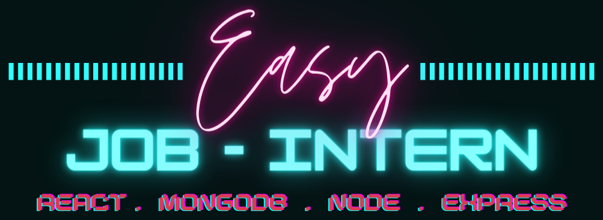
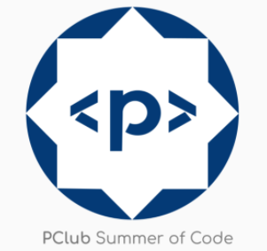

<!-- Banner -->
<div class="container-fluid">
  
</div>
<!-- ALL-CONTRIBUTORS-BADGE:START - Do not remove or modify this section -->
<!-- ALL-CONTRIBUTORS-BADGE:END -->
 
<h2 align="center">


[](https://discord.gg/PBuuPMSVjB)
[](https://github.com/pankajkumarbij/easy-job-intern/issues)
[](https://github.com/pankajkumarbij/easy-job-intern/network)
[](https://github.com/pankajkumarbij/easy-job-intern)
[](https://github.com/pankajkumarbij/easy-job-intern)


</h2>

# About

<p align="center"></p>

<p>

The main motive behind the design of this project to provide the best job and internship opportunities. Companies can post here open application for job and internship so students can make own profile and apply in multiple companies.

Join Discord : https://discord.gg/PBuuPMSVjB

## 🛠️ Technology Stack

      

# Contribution Guidelines

1. Fork this repository.

2. Clone the repository:

```
git clone https://github.com/<your-user-name>/easy-job-intern.git
```

3. Change working directory to project:

```
cd easy-job-intern
```

4. Install packages:

```
  (a) npm install
  (b) cd server/
      npm install
```

5. Run the project:

```
  (a) for run client 'npm start'
  (b) for run server use 'nodemon' or 'node index.js' after change directory to server.
```
Start Working on it and make a PR.
<br>
For a more clear understanding of contribution guidelines please read <a href="https://github.com/pankajkumarbij/easy-job-intern/blob/master/contributing.md">contributing.MD</a> file.

# Open Source Programs we have been associated with: 

<p align="center">
<a href="https://crosswoc.ieeedtu.in/"></a>
<a href="https://gssoc.girlscript.tech/"></a>
<a href="https://www.pclubsummerofcode.in/"></a>  
</p>

## ❤️&nbsp; Project Admin & Mentor

<table>
<tr>
    <td align="center" thead="admin"><a href="https://github.com/pankajkumarbij"><br /><sub><b> Pankaj Kumar Bijarniya </b></sub></a></td></tr>
  </tr>
  </table>

# Contributors:
<a href="https://github.com/pankajkumarbij/easy-job-intern/graphs/contributors">
  
</a>

💜 **Thanks**
